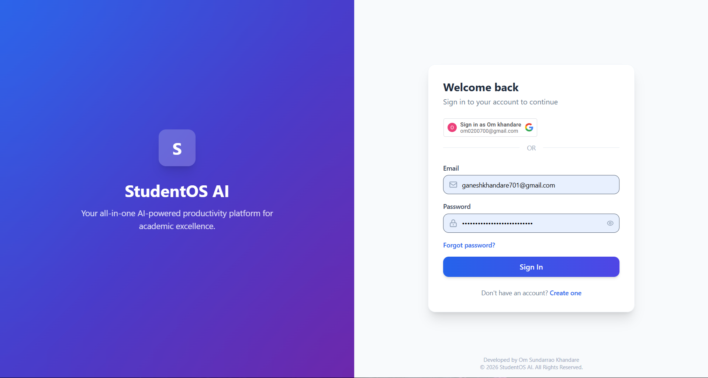
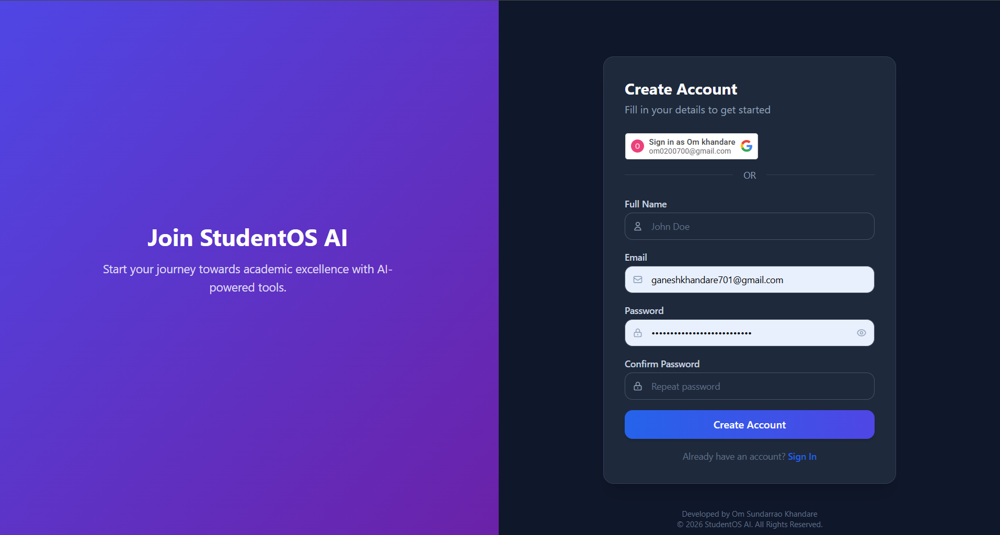
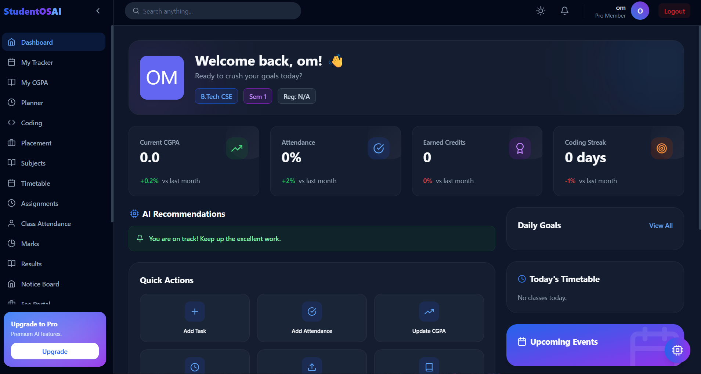

# 🎓 StudentOS AI

StudentOS AI is a modern student management system built using the MERN Stack.

## 🚀 Live Demo

https://student-os-ai-plum.vercel.app

## ✨ Features

- Student Login
- Google Authentication
- Student Dashboard
- Secure JWT Authentication
- Mobile Responsive
- MongoDB Database
- Admin Features

## 🛠 Tech Stack

- React
- Node.js
- Express.js
- MongoDB Atlas
- Vercel
- Render

## 📸 Screenshots

### Login

### Register

### Dashboard

## 👨‍💻 Developer

Om Sundarrao Khandare